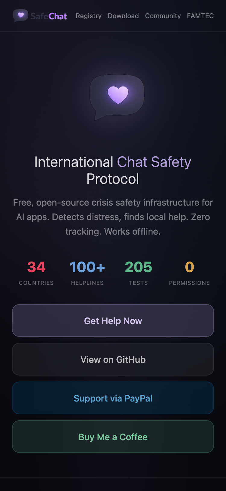
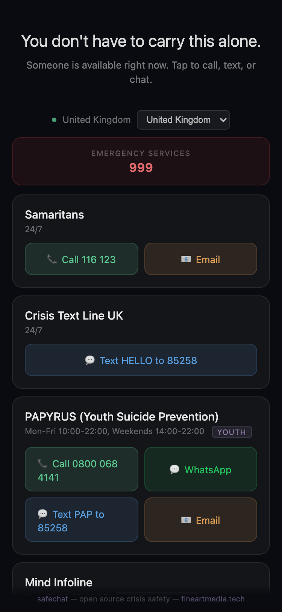
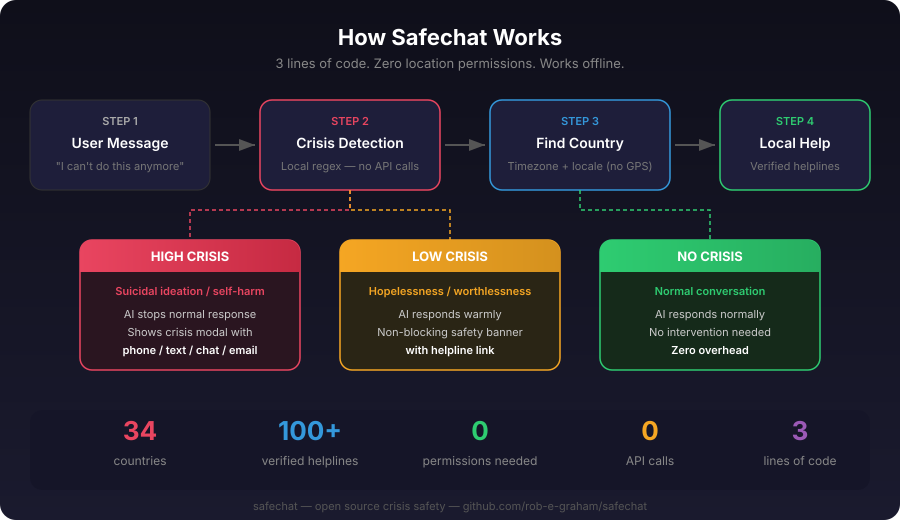
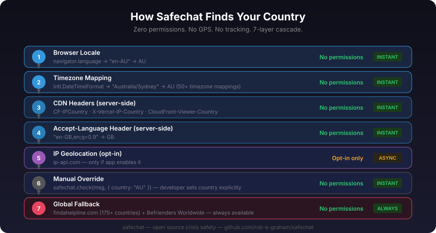
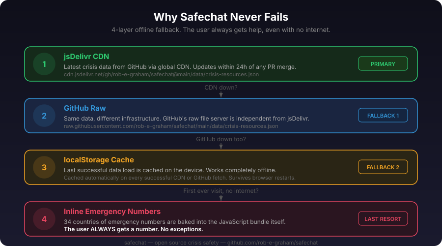

<p align="center">
  
</p>

<h1 align="center">SafeChat</h1>
<h3 align="center">International Chat Safety Protocol</h3>

<p align="center">
  Open-source crisis safety infrastructure for AI apps.<br>
  Detects distress, finds local help. Zero tracking. Works offline.
</p>

<p align="center">
  <strong>34 countries &middot; 100+ verified helplines &middot; 205 safety tests &middot; 0 permissions</strong>
</p>

<p align="center">
  <a href="https://rob-e-graham.github.io/safechat/app/index.html">Live Site</a> &middot;
  <a href="https://rob-e-graham.github.io/safechat/app/popup.html">Get Help Now</a> &middot;
  <a href="https://github.com/rob-e-graham/safechat/discussions">Community</a> &middot;
  <a href="https://fineartmedia.tech">FAMTEC</a>
</p>

---

<p align="center">
  
  &nbsp;&nbsp;&nbsp;
  
</p>

---

## What is SafeChat?

SafeChat is an **international register and toolkit for chat safety protocol**. Free for everyone. Built for developers, health professionals, and communities.

- **Crisis Detection** — Regex-based detection runs locally. No API calls. No data leaves the device. Catches misspellings, text-speak, indirect warning signs, and passive suicidality.
- **Geo-Location (No GPS)** — Finds the user's country from timezone and locale. No permissions needed. 7-layer cascade.
- **Verified Helpline Database** — 100+ helplines across 34 countries. Phone, text, chat, email, WhatsApp. CC0 public domain.
- **AI Prompt Override** — System prompt injections that tell your LLM to show crisis resources. Works with any AI provider.
- **Drop-in UI** — Modal, banner, and full-page popup. One script tag. PWA-capable. Works offline.
- **Compliance-Ready** — Aligned with NY AI Companion Law, FTC chatbot safety requirements, VERA-MH framework, and Samaritans guidelines.

---

## Install as App (PWA)

SafeChat works as a standalone app on any device:

- **iPhone/iPad:** Open the popup in Safari → tap Share → "Add to Home Screen"
- **Android:** Open in Chrome → menu → "Install App"
- **Desktop:** Open in Chrome/Edge → click install icon in address bar

**Open the popup:** [rob-e-graham.github.io/safechat/app/popup.html](https://rob-e-graham.github.io/safechat/app/popup.html)

---

## Quick Start

### Browser (no build step)

```html
<script src="https://cdn.jsdelivr.net/gh/rob-e-graham/safechat@main/src/browser.js"></script>
<script>
  Safechat.protect(); // auto-monitor all text inputs
</script>
```

### One-line embed

```html
<script src="https://cdn.jsdelivr.net/gh/rob-e-graham/safechat@main/src/embed.js"
        data-safechat-monitor="true"></script>
```

### Node.js / npm

```bash
npm install safechat
```

```javascript
const safechat = require('safechat');

const safety = safechat.check(userMessage);

if (safety.level === 'high') {
  systemPrompt = safechat.promptOverride('high', safety.country)
                 + '\n\n' + systemPrompt;
}
```

### Express middleware

```javascript
const safechat = require('safechat');
app.use(safechat.middleware());

app.post('/api/chat', (req, res) => {
  const safety = req.safechat.check(req.body.message);
  if (safety.action === 'crisis_intervention') {
    systemPrompt = req.safechat.promptOverride(safety.level) + '\n\n' + systemPrompt;
  }
});
```

### Embed the popup

```html
<iframe src="https://rob-e-graham.github.io/safechat/app/popup.html"
        style="width:100%;max-width:480px;height:700px;border:none;border-radius:16px;">
</iframe>
```

---

## How Detection Works



Detection uses regex pattern matching with three layers:

1. **Input normalisation** — Smart quotes → ASCII, whitespace collapse, misspelling correction, text-speak expansion
2. **Pattern matching** — HIGH signals (explicit suicidal language, methods) and LOW signals (hopelessness, worthlessness)
3. **False-positive guards** — Context-aware filtering skips figurative language ("cut my hair", "suicide squeeze play", "overdosed on coffee")

| Level | Triggers | Action |
|-------|----------|--------|
| **high** | Suicidal ideation, self-harm, explicit intent | Show crisis resources immediately |
| **low** | Hopelessness, worthlessness, feeling trapped | Soft safety response with helpline link |
| **none** | No crisis signals | Normal operation |

---

## Geo-Detection



SafeChat finds the user's country **without location permissions**:

| Priority | Method | Permissions |
|----------|--------|-------------|
| 1 | Browser locale (`navigator.language`) | None |
| 2 | Timezone (`Intl.DateTimeFormat`) | None |
| 3 | CDN headers (`CF-IPCountry`, `X-Vercel-IP-Country`) | None |
| 4 | Accept-Language header | None |
| 5 | Manual override | None |
| 6 | Global fallback (findahelpline.com) | None |

---

## Auto-Updating Crisis Data



```
1. jsDelivr CDN (latest data)           ← primary
2. GitHub raw (same data, different CDN) ← if jsDelivr down
3. localStorage cache                    ← if offline
4. Inline emergency numbers              ← if never loaded
```

Verification workflow runs twice monthly to check all phone numbers and URLs.

---

## Security

SafeChat is designed for trust:

- **Zero data collection** — all detection runs locally, nothing is transmitted
- **Content Security Policy** — CSP headers on all pages
- **HTML escaping** — all dynamic content is escaped to prevent XSS
- **Input validation** — type checking, ReDoS protection, JSON structure validation
- **Scoped service worker** — only intercepts same-origin requests
- **No cookies, no analytics, no tracking**
- **205 automated tests** including security/adversarial inputs
- **Referrer policy** — `no-referrer` on all pages

---

## API

### `safechat.check(text, options?)`

```javascript
safechat.check("I can't go on anymore", { country: "AU" });
// { level: "low", matched: "can't go on", country: "AU", action: "soft_warning", resources: {...} }
```

### `safechat.detect(text)`

```javascript
safechat.detect("I want to kill myself")  // { level: "high", matched: "kill myself" }
safechat.detect("I feel worthless")       // { level: "low", matched: "worthless" }
safechat.detect("great day today")        // { level: "none", matched: null }
```

### `safechat.promptOverride(level, countryCode)`
### `safechat.getResources(countryCode, options?)`
### `safechat.middleware()`

---

## Countries Covered

Australia, Austria, Belgium, Brazil, Canada, China, Denmark, Finland, France, Germany, Ghana, Hong Kong, India, Ireland, Israel, Italy, Japan, Kenya, Mexico, Netherlands, New Zealand, Nigeria, Norway, Pakistan, Philippines, Portugal, Russia, South Africa, South Korea, Spain, Sweden, Switzerland, United Kingdom, United States.

**Plus global fallback** via [findahelpline.com](https://findahelpline.com) (175+ countries).

---

## Licensing

SafeChat uses **Business Source License (BSL 1.1)**.

**Free for:**
- Personal, educational, research, nonprofit/community use
- Commercial entities under $100,000 USD annual revenue

**Commercial entities over $100K** must obtain a commercial license: rob@fineartmedia.tech

Changes to MPL 2.0 on 2029-01-01.

---

## Support the Project

- [PayPal](https://paypal.me/specialrequest)
- [Buy Me a Coffee](https://buymeacoffee.com/famtec)

---

## Contributing

Help keep crisis resources accurate and expand to more countries. See [CONTRIBUTING.md](CONTRIBUTING.md).

This project follows [Samaritans safe messaging guidelines](https://www.samaritans.org/about-samaritans/media-guidelines/).

---

## Community

- [GitHub Discussions](https://github.com/rob-e-graham/safechat/discussions) — questions, research, standards
- [Issues](https://github.com/rob-e-graham/safechat/issues) — bugs, wrong numbers, detection gaps
- [FAMTEC](https://fineartmedia.tech) — the team behind SafeChat

---

<p align="center">
  Created by <a href="https://fineartmedia.tech">Rob Graham / FAMTEC</a>
</p>

<p align="center">
  If you or someone you know is in crisis: <strong><a href="https://findahelpline.com">findahelpline.com</a></strong>
</p>
