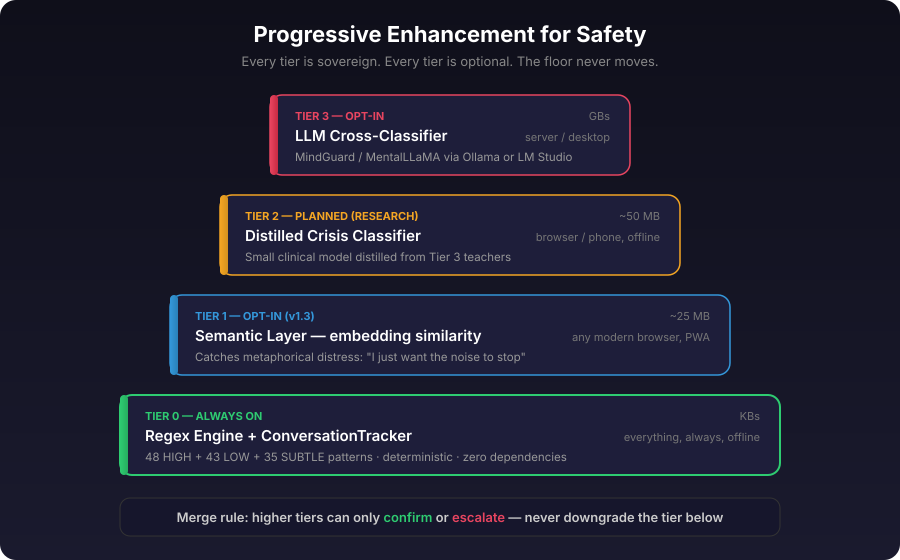
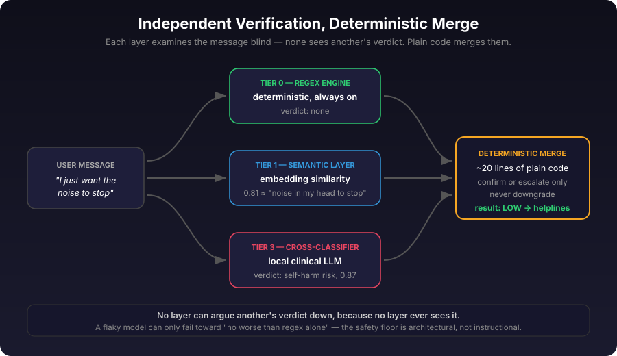

<p align="center">
  
</p>

<h1 align="center">SafeChat</h1>
<h3 align="center">International Chat Safety Protocol</h3>

<p align="center">
  Source-available crisis safety infrastructure for AI apps.<br>
  Detects distress, finds local help. Zero tracking. Works offline.
</p>

<p align="center">
  <strong>34 countries &middot; 100+ verified helplines &middot; 596 safety tests &middot; 0 permissions</strong>
</p>

<p align="center">
  <a href="https://rob-e-graham.github.io/safechat/app/index.html">Live Site</a> &middot;
  <a href="https://rob-e-graham.github.io/safechat/app/popup.html">Get Help Now</a> &middot;
  <a href="https://github.com/rob-e-graham/safechat/discussions">Community</a> &middot;
  <a href="https://fineartmedia.tech">FAMTEC</a>
</p>

---

<p align="center">
  
  &nbsp;&nbsp;&nbsp;
  
</p>

---

## What is SafeChat?

SafeChat is an **international register and toolkit for chat safety protocol**. Free for everyone. Built for developers, health professionals, and communities.

- **Crisis Detection** — Regex-based detection runs locally. No API calls. No data leaves the device. Catches misspellings, text-speak, indirect warning signs, and passive suicidality.
- **Geo-Location (No GPS)** — Finds the user's country from timezone and locale. No permissions needed. 7-layer cascade.
- **Verified Helpline Database** — 100+ helplines across 34 countries. Phone, text, chat, email, WhatsApp. CC0 public domain.
- **AI Prompt Override** — System prompt injections that tell your LLM to show crisis resources. Works with any AI provider.
- **Drop-in UI** — Modal, banner, and full-page popup. One script tag. PWA-capable. Works offline.
- **Compliance-Ready** — Aligned with NY AI Companion Law, FTC chatbot safety requirements, VERA-MH framework, and Samaritans guidelines.

---

## Install as App (PWA)

SafeChat works as a standalone app on any device:

- **iPhone/iPad:** Open the popup in Safari → tap Share → "Add to Home Screen"
- **Android:** Open in Chrome → menu → "Install App"
- **Desktop:** Open in Chrome/Edge → click install icon in address bar

**Open the popup:** [rob-e-graham.github.io/safechat/app/popup.html](https://rob-e-graham.github.io/safechat/app/popup.html)

---

## Quick Start

### Browser (no build step)

```html
<script src="https://cdn.jsdelivr.net/gh/rob-e-graham/safechat@main/src/browser.js"></script>
<script>
  Safechat.protect(); // auto-monitor all text inputs
</script>
```

### One-line embed

```html
<script src="https://cdn.jsdelivr.net/gh/rob-e-graham/safechat@main/src/embed.js"
        data-safechat-monitor="true"></script>
```

### Node.js / npm

```bash
npm install safechat
```

```javascript
const safechat = require('safechat');

const safety = safechat.check(userMessage);

if (safety.level === 'high') {
  systemPrompt = safechat.promptOverride('high', safety.country)
                 + '\n\n' + systemPrompt;
}
```

### Express middleware

```javascript
const safechat = require('safechat');
app.use(safechat.middleware());

app.post('/api/chat', (req, res) => {
  const safety = req.safechat.check(req.body.message);
  if (safety.action === 'crisis_intervention') {
    systemPrompt = req.safechat.promptOverride(safety.level) + '\n\n' + systemPrompt;
  }
});
```

### Embed the popup

```html
<iframe src="https://rob-e-graham.github.io/safechat/app/popup.html"
        style="width:100%;max-width:480px;height:700px;border:none;border-radius:16px;">
</iframe>
```

---

## How Detection Works


Detection uses regex pattern matching with three layers:

1. **Input normalisation** — Smart quotes → ASCII, whitespace collapse, misspelling correction, text-speak expansion
2. **Pattern matching** — HIGH signals (explicit suicidal language, methods) and LOW signals (hopelessness, worthlessness)
3. **False-positive guards** — Context-aware filtering skips figurative language ("cut my hair", "suicide squeeze play", "overdosed on coffee")

| Level | Triggers | Action |
|-------|----------|--------|
| **high** | Suicidal ideation, self-harm, explicit intent | Show crisis resources immediately |
| **low** | Hopelessness, worthlessness, feeling trapped | Soft safety response with helpline link |
| **none** | No crisis signals | Normal operation |

Threat and hate-speech detection are exposed separately through `detectModeration()`.
They do not trigger crisis-resource routing by default; they return local moderation
signals that an app can use for review, de-escalation, or harm prevention.

---

## Geo-Detection


SafeChat finds the user's country **without location permissions**:

| Priority | Method | Permissions |
|----------|--------|-------------|
| 1 | Browser locale (`navigator.language`) | None |
| 2 | Timezone (`Intl.DateTimeFormat`) | None |
| 3 | CDN headers (`CF-IPCountry`, `X-Vercel-IP-Country`) | None |
| 4 | Accept-Language header | None |
| 5 | Manual override | None |
| 6 | Global fallback (findahelpline.com) | None |

---

## Auto-Updating Crisis Data


```
1. jsDelivr CDN (latest data)           ← primary
2. GitHub raw (same data, different CDN) ← if jsDelivr down
3. localStorage cache                    ← if offline
4. Inline emergency numbers              ← if never loaded
```

Verification workflow runs twice monthly to check all phone numbers and URLs.

---

## Security

SafeChat is designed for trust:

- **Zero data collection** — all detection runs locally, nothing is transmitted
- **Content Security Policy** — CSP headers on all pages
- **HTML escaping** — all dynamic content is escaped to prevent XSS
- **Input validation** — type checking, ReDoS protection, JSON structure validation
- **Scoped service worker** — only intercepts same-origin requests
- **No cookies, no analytics, no tracking**
- **596 automated tests** including security/adversarial inputs
- **Referrer policy** — `no-referrer` on all pages

---

## API

### `safechat.check(text, options?)`

```javascript
safechat.check("I can't go on anymore", { country: "AU" });
// { level: "low", matched: "can't go on", country: "AU", action: "soft_warning", resources: {...} }
```

### `safechat.detect(text)`

```javascript
safechat.detect("I want to kill myself")  // { level: "high", matched: "kill myself" }
safechat.detect("I feel worthless")       // { level: "low", matched: "worthless" }
safechat.detect("great day today")        // { level: "none", matched: null }
```

### `safechat.detectModeration(text)`

```javascript
safechat.detectModeration("I want to kill you")
// { level: "high", category: "threat", matched: "i want to kill you" }

safechat.detectModeration("great day today")
// { level: "none", category: null, matched: null }
```

### `safechat.promptOverride(level, countryCode)`
### `safechat.getResources(countryCode, options?)`
### `safechat.middleware()`

---

## Cross-Classifier (Optional ML Layer)

SafeChat v1.2 introduces an optional cross-classifier module that runs local ML models alongside the regex engine. The regex layer stays as the fast, deterministic, always-on first pass. The cross-classifier provides a second opinion.

Suggested by [Professor Stevie Chancellor](https://www.steviechancellor.com/) (University of Minnesota) and informed by research from the [VERA-MH](https://www.springhealth.com) evaluation framework.

### Supported models

- **[MindGuard](https://huggingface.co/swordhealth)** (Sword Health) -- 4B/8B crisis classifier. Safe, self-harm, harm-to-others.
- **[MentalLLaMA](https://github.com/SteveKGYang/MentalLLaMA)** -- 7B/13B mental health analysis. Depression, stress, suicidal ideation.
- **[MentalChat16K](https://dl.acm.org/doi/10.1145/3711896.3737393)** -- Benchmark dataset for evaluation.
- Any local model via **Ollama**, **LM Studio**, or a **custom function**.

### Merge rules

The classifier never downgrades a regex detection. If regex says HIGH and the model says safe, it stays HIGH. False negatives cost lives.

```javascript
const safechat = require('safechat');

const cc = safechat.createCrossClassifier({
  backend: 'ollama',
  model: 'mindguard-8b',
  endpoint: 'http://localhost:11434',
});

const shield = safechat.createShield({
  crisis: true,
  subtle: true,
  crossClassifier: cc,
});

// Async processing with cross-classifier verification
const result = await shield.processAsync(userMessage);
// result.crossClassifier.mergeAction = 'confirmed' | 'escalated' | 'regex_override'
```

Everything runs locally. No data leaves the device.

---

## Semantic Layer (Optional Embedding Tier) — v1.3



SafeChat v1.3 adds a **semantic layer**: an embedding-similarity tier light enough to run in any modern browser — including installed PWAs on phones — fully offline after first load. It catches metaphorical distress that keyword patterns can't express ("I just want the noise to stop") by comparing each message against a curated set of crisis exemplar phrases in embedding space.

- **~25 MB** instead of gigabytes — works with small sentence-embedding models like all-MiniLM-L6-v2
- **Same merge contract** as the cross-classifier: confirm or escalate, never downgrade
- **Plain-text exemplars** — auditable, replaceable, community-ownable for culturally specific language packs
- **Zero new dependencies** — the embedder is injected; SafeChat works identically without it

```javascript
// Browser / PWA with Transformers.js
import { pipeline } from '@huggingface/transformers';
const extractor = await pipeline('feature-extraction', 'Xenova/all-MiniLM-L6-v2');

const sem = safechat.createSemanticLayer({
  backend: 'custom',
  embed: async (texts) => {
    const out = await extractor(texts, { pooling: 'mean', normalize: true });
    return out.tolist();
  },
});

// Or server-side via Ollama
const sem = safechat.createSemanticLayer({
  backend: 'ollama',
  model: 'nomic-embed-text',
});

const shield = safechat.createShield({ crisis: true, semanticLayer: sem });
const result = await shield.processAsync(userMessage);
// result.semantic.mergeAction = 'confirmed' | 'escalated' | 'regex_override' | 'passthrough'
```

### How the layers combine



Every layer examines the message independently — no layer sees another's verdict, so no layer can be anchored by it or argue it down. A deterministic merge (~20 lines of auditable code, not a model) takes the most cautious opinion. The safety floor is architectural: a flaky model can only fail toward "no worse than regex alone."

| Tier | Layer | Footprint | Runs on |
|------|-------|-----------|---------|
| 0 | Regex engine + ConversationTracker | KBs | Everything, always, offline |
| 1 | Semantic layer (embedding similarity) | ~25 MB | Any modern browser, PWA |
| 2 | Distilled crisis classifier (planned) | ~50 MB | Browser/phone, offline |
| 3 | LLM cross-classifier | GBs | Server/desktop, opt-in |

---

## Countries Covered

Australia, Austria, Belgium, Brazil, Canada, China, Denmark, Finland, France, Germany, Ghana, Hong Kong, India, Ireland, Israel, Italy, Japan, Kenya, Mexico, Netherlands, New Zealand, Nigeria, Norway, Pakistan, Philippines, Portugal, Russia, South Africa, South Korea, Spain, Sweden, Switzerland, United Kingdom, United States.

**Plus global fallback** via [findahelpline.com](https://findahelpline.com) (175+ countries).

---

## Ongoing Development

SafeChat is under continuous, active development. See [CHANGELOG.md](CHANGELOG.md) for a full record of detection improvements, new patterns, and accuracy gains. Every change is tested, timestamped, and publicly documented.

- **False negatives** are treated as critical defects
- **Crisis resource data** is verified twice monthly
- **Test suite** must pass before every release (currently 596 tests)
- **Detection patterns** are reviewed against published clinical literature

---

## Licensing

SafeChat uses **Business Source License (BSL 1.1)**.

**Free for:**
- Personal, educational, research, nonprofit/community use
- Commercial entities under $100,000 USD annual revenue

**Commercial entities over $100K** must obtain a commercial license: rob@fineartmedia.tech

Changes to MPL 2.0 on 2029-01-01.

---

## Legal Disclaimer

SafeChat is provided **as is**. It is not emergency medical care, legal advice, professional mental health treatment, or a substitute for emergency services, clinicians, safeguarding teams, or local crisis procedures.

By downloading, installing, deploying, integrating, or using SafeChat, you accept responsibility for your own installation, configuration, compliance, testing, supervision, and use. To the maximum extent permitted by law, Rob Graham, FAMTEC, contributors, maintainers, copyright holders, and licensors are not liable for damages, losses, legal claims, regulatory penalties, system damage, data loss, personal injury, death, failure to obtain help, failure to detect crisis content, unlawful use, or other harm arising from installation or use.

SafeChat is a routing layer, not a diagnostic tool. It identifies textual signals and connects users to professional resources. It does not assess clinical risk or replace professional mental health services.

If you do not accept these terms, do not download, install, deploy, integrate, or use SafeChat. See [LICENSE](LICENSE) and [docs/legal-disclaimer.md](docs/legal-disclaimer.md) for the full disclaimer, integrator responsibilities, and limitation of liability.

---

## Support the Project

- [Support SafeChat](https://www.paypal.com/paypalme/specialrequest)

---

## Contributing

Help keep crisis resources accurate and expand to more countries. See [CONTRIBUTING.md](CONTRIBUTING.md).

This project follows [Samaritans safe messaging guidelines](https://www.samaritans.org/about-samaritans/media-guidelines/).

---

## Community

- [GitHub Discussions](https://github.com/rob-e-graham/safechat/discussions) — questions, research, standards
- [Issues](https://github.com/rob-e-graham/safechat/issues) — bugs, wrong numbers, detection gaps
- [FAMTEC](https://fineartmedia.tech) — the team behind SafeChat

---

<p align="center">
  Created by <a href="https://fineartmedia.tech">Rob Graham / FAMTEC</a>
</p>

<p align="center">
  If you or someone you know is in crisis: <strong><a href="https://findahelpline.com">findahelpline.com</a></strong>
</p>
